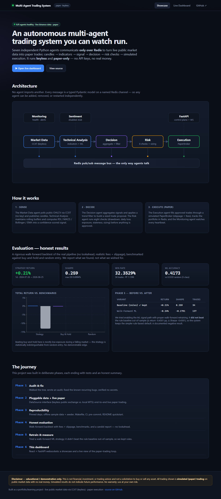
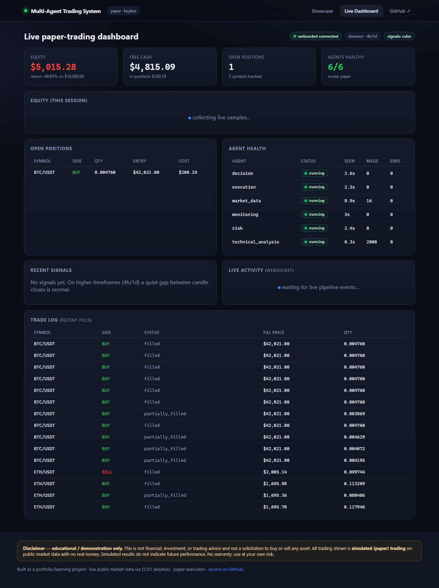

# Multi-Agent Trading System

[](https://github.com/Chinmay258/Multi-agent-trading-system/actions/workflows/ci.yml)


> An autonomous, **multi-agent** crypto trading system you can watch run. Seven independent
> Python agents communicate **only over Redis** to turn **live public market data** into
> **paper trades**: candles → indicators → signal → decision → risk checks → simulated
> execution. It runs **keyless** (no API keys) and **paper-only** (no real money), is fully
> reproducible, and is **evaluated honestly** — including where the strategy shows no edge.

> ⚠️ **Educational / demo only. Not financial advice. No solicitation. No real money.**
> See the [Disclaimer](DISCLAIMER.md).

**🔴 Live demo:** **<https://multi-agent-trading.lovable.app>**
*(runs on realistic animated demo data until the backend is deployed, then streams live)*

---

## Screenshots

**Showcase** — architecture, how-it-works, and the honest evaluation results:



**Live dashboard** — real-time paper equity, positions, per-agent health, signals, trade log:



---

## Honest headline results

A rigorous, no-lookahead backtest of the real pipeline (realistic fees + slippage),
benchmarked against buy-and-hold and random entry. BTC/USDT, 1d, ~2 years, out-of-sample:

| | Total return | Sharpe | Win rate |
|---|---|---|---|
| **Rule-based strategy (default)** | **+0.21%** | **+0.26** | 32% |
| Buy & hold | −13.0% | +0.07 | — |
| Random entry (mean of 200) | −0.21% | −0.32 | 29% |

**No demonstrable edge:** the strategy is statistically indistinguishable from random entry,
and the ML classifier scores ~0.42 vs 0.33 random on a 3-class problem. We attempted a
walk-forward ML strategy (Phase 5) — it **did not beat** the rule baseline out-of-sample, so
we kept the simpler default and documented the negative result. Full detail:
[docs/EVALUATION.md](docs/EVALUATION.md) · [docs/MODEL_CHANGES.md](docs/MODEL_CHANGES.md) ·
regenerate with `make eval`.

---

## Architecture

Seven agents, one Redis message bus, two pluggable seams (keyless data + paper execution) so
the whole thing runs with **zero secrets**. Full detail in
[docs/ARCHITECTURE.md](docs/ARCHITECTURE.md).

```
 Market Data ─▶ Technical Analysis ─▶ Decision ─▶ Risk ─▶ Execution (PaperBroker)
      │                │                  │         │            │
      └──────── Redis pub/sub bus ── Monitoring ── FastAPI control plane (REST + WS) ──┘
```

---

## Quickstart (keyless, ~2 minutes)

**Prerequisites:** Docker + Docker Compose.

```bash
git clone https://github.com/Chinmay258/Multi-agent-trading-system.git
cd Multi-agent-trading-system

cp .env.example .env          # safe defaults, zero secrets
make up                       # build + start infra, 7 agents, API, dashboard (paper mode)
make migrate                  # create the database schema
make verify                   # green/red health table for every service
```

Then open:

| What | URL |
|------|-----|
| **Dashboard** | http://localhost:3000 |
| Control-plane API (health) | http://localhost:8000/health |
| Open positions / balance | http://localhost:8000/positions |

> Seeing a blank page? Open **http://localhost:3000** (the built app served by nginx) — not
> the `dashboard/index.html` source file. For hot-reload dev: `cd dashboard && npm run dev`.

Optional — load the bundled offline dataset (no network) for instant warmup / backtests:
`make seed`. Stop with `make down`; deep-clean with `make clean`.

### Local Python dev (no Docker)

```bash
make setup     # venv + install (TA-Lib is optional — NumPy fallback; `.[talib]` for the real thing)
make test      # full suite (no infra needed)
make e2e       # the keyless end-to-end pipeline test
```

---

## Make targets

| Target | What it does |
|--------|--------------|
| `make setup` | Create a venv and install the project (dev extras) |
| `make up` / `make run` | Start the full keyless paper-trading stack |
| `make migrate` / `make seed` | DB migrations / load the bundled offline dataset |
| `make verify` | Green/red health table for all services |
| `make test` / `make e2e` | Full test suite / end-to-end pipeline test |
| `make lint` / `make format` | Ruff lint+format check / auto-format |
| `make eval` / `make train` | Regenerate the evaluation report / train the model |
| `make prod-up` / `make prod-down` | Run the production stack locally (Caddy HTTPS) |
| `make deploy` / `make destroy` | Provision / tear down the cloud VM (Terraform) |
| `make down` / `make clean` | Stop / deep-clean |

---

## Deploy to the cloud (free, paper-only)

A single small VM runs the whole stack behind **Caddy** (automatic HTTPS). Recommended
target: **Oracle Cloud Always Free** (ARM — free *forever*, fits the full stack). Keyless, so
no secrets are needed to deploy.

```bash
make prod-up   # test the production stack locally → https://localhost
make deploy    # provision the VM via Terraform (infra/terraform)
make destroy   # tear it all down — no surprise billing
```

Full walkthrough (Oracle free tier, managed alternatives, lite profile, cost estimate,
teardown): **[docs/DEPLOYMENT.md](docs/DEPLOYMENT.md)**.

**Two frontends, your choice:** the repo ships a bundled React dashboard (served by
`make run`, same-origin, zero config). There is also a premium **Lovable** frontend
([live at multi-agent-trading.lovable.app](https://multi-agent-trading.lovable.app)) —
set `API_BASE` in its `src/config.ts` to your deployed backend URL to make it stream live data.

---

## Reproducibility

- **Keyless:** no API keys, broker logins, or tokens needed for the demo, tests, or backtest.
- **Pinned dependencies:** `pyproject.toml` is fully pinned; `requirements-lock.txt` is the
  exact verified runtime set.
- **Offline data:** `data/sample/` ships real OHLCV (BTC/ETH, 1h/4h/1d) so the demo and tests
  run with **zero external calls**.
- **CI:** lint (ruff) · secret scan (gitleaks) · unit tests (3.11/3.12) · integration + e2e ·
  Docker image build · dashboard build + Playwright smoke.
- **Pre-commit:** `pre-commit install` (ruff + gitleaks + hygiene).

---

## Configuration

Every variable is documented in [.env.example](.env.example). The most important ones:

| Variable | Default | Meaning |
|----------|---------|---------|
| `TRADING_MODE` | `paper` | `paper` (simulated) or `live` (real money — out of scope) |
| `EXECUTION_BROKER` | `paper` | `paper` or `mt5` (local terminal) |
| `DATA_SOURCE` | `public` | `public` (keyless CCXT), `mt5` (local read-only), or `auto` |
| `TA_USE_ML_SIGNALS` | `false` | rules (default; ML didn't beat it — see EVALUATION.md) |

---

## Documentation

- [docs/ARCHITECTURE.md](docs/ARCHITECTURE.md) — agents, channels, pluggable seams, invariants
- [docs/EVALUATION.md](docs/EVALUATION.md) — methodology + honest results
- [docs/MODEL_CHANGES.md](docs/MODEL_CHANGES.md) — the Phase-5 retrain attempt (a negative result)
- [docs/DEPLOYMENT.md](docs/DEPLOYMENT.md) — deploy to a single VM + teardown

---

## License & disclaimer

[MIT](LICENSE). This is an **educational/demo project**: not financial advice, not a
solicitation, simulated paper trading only, no warranty. Please read the full
**[Disclaimer](DISCLAIMER.md)** before using or adapting it.
